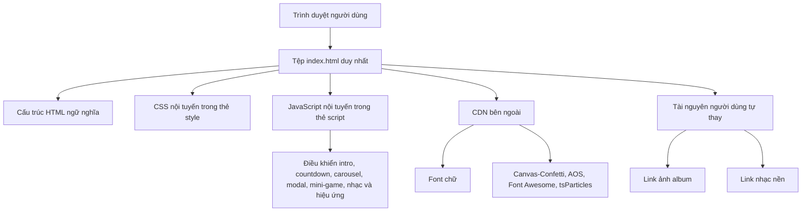

## 1. Thiết kế kiến trúc


## 2. Mô tả công nghệ
- Frontend: HTML5 + CSS3 + JavaScript thuần ES2020 trong một file duy nhất.
- Thư viện giao diện và hiệu ứng: AOS qua CDN cho scroll reveal, Canvas-Confetti cho pháo hoa giấy, Font Awesome cho icon, tsParticles cho nền hạt động.
- Công cụ khởi tạo: không cần scaffold vì yêu cầu là một tệp `index.html` độc lập.
- Backend: Không sử dụng.
- Dữ liệu: nội dung tĩnh nhúng trực tiếp trong JavaScript, bao gồm lời chúc ngẫu nhiên, dữ liệu album, kịch bản mini-game và cấu hình mốc thời gian sinh nhật tuổi 20.

## 3. Định nghĩa tuyến trang
| Tuyến | Mục đích |
|-------|----------|
| / | Hiển thị toàn bộ trải nghiệm chúc mừng sinh nhật trong một trang duy nhất |

## 4. Tổ chức mã nguồn
| Khối mã | Vai trò |
|---------|---------|
| HTML | Khai báo cấu trúc intro, hero, đồng hồ thời gian, carousel ảnh, lightbox, thư chúc mừng, mini-game, modal, nút nhạc và audio |
| CSS | Quản lý theme pastel gradient, glassmorphism, layout responsive, animation, lightbox, carousel, emoji burst, modal và hiệu ứng tương tác |
| JavaScript | Xử lý mở quà, confetti, countdown từng giây, elapsed timer, typing, carousel, lightbox, mini-game, emoji burst, music player và modal |

## 5. Chiến lược tương tác
- Chỉ phát nhạc sau thao tác bấm đầu tiên để phù hợp chính sách autoplay của trình duyệt.
- Hiệu ứng được xây dựng bằng `transform`, `opacity`, `requestAnimationFrame`, animation CSS và CDN animation library để giảm giật lag.
- Các thành phần tương tác phải có phản hồi hover và tap rõ ràng.
- Modal hỗ trợ đóng bằng nút bấm, vùng nền overlay và phím `Escape`.
- Carousel hỗ trợ tự chạy, next/prev và click ảnh để mở lightbox.
- Countdown tự chuyển đổi giữa trạng thái “đếm tới sinh nhật tuổi 20” và “đã bước sang tuổi 20 được bao lâu”.

## 6. Mô hình dữ liệu giao diện
### 6.1 Dữ liệu tĩnh
```ts
type WishMessage = {
  text: string
}

type GalleryItem = {
  imageUrl: string
  caption: string
}

type SurpriseItem = {
  title: string
  message: string
  effect: string
}
```

### 6.2 Nguồn dữ liệu trong trang
- `wishMessages`: mảng các câu chúc dùng ngẫu nhiên trong modal.
- `galleryItems`: mảng khung ảnh mẫu với đường dẫn ảnh để người dùng thay thủ công.
- `surpriseItems`: mảng dữ liệu cho mini-game cửa hàng điều ước.
- `birthdayProfile`: thông tin tên, ngày sinh, mốc tuổi 20 và lời chúc chính.

## 7. Tiêu chuẩn triển khai
- Mọi mã nằm trong duy nhất `index.html`.
- Có comment rõ khu vực thay ảnh, thay nhạc, thay lời chúc dài và chỉnh dữ liệu mini-game.
- Ưu tiên khả năng mở trực tiếp bằng trình duyệt mà không cần build.
- Tối ưu cho kích thước màn hình nhỏ, hỗ trợ bàn phím cơ bản và giảm chuyển động nếu người dùng bật `prefers-reduced-motion`.
