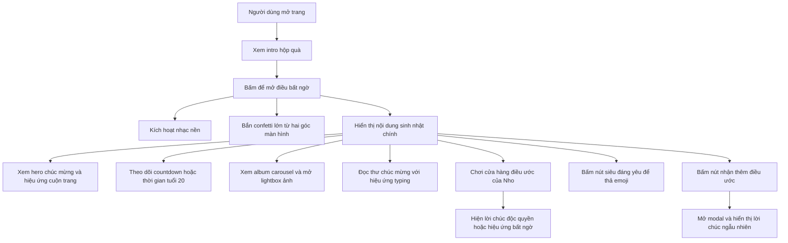

## 1. Tổng quan sản phẩm
Trang web là một trang chúc mừng sinh nhật độc lập, chạy trực tiếp trên trình duyệt bằng một file `index.html`, dành riêng cho Phan Thị Hồng Nho nhân dịp bước sang tuổi 20 vào ngày 01/07/2026.
- Mục tiêu chính là nâng cấp trải nghiệm thành một phiên bản cao cấp, hiện đại, giàu tương tác với hiệu ứng mở quà, nhạc nền, pháo hoa giấy lớn, nền hạt lấp lánh, carousel ảnh, mini-game và các bất ngờ cá nhân hóa.
- Giá trị của trang nằm ở tính cá nhân hóa cao, dễ chia sẻ, dễ chỉnh sửa nội dung về sau và tối ưu hiển thị mượt mà trên cả máy tính lẫn điện thoại.

## 2. Tính năng cốt lõi

### 2.1 Mô-đun tính năng
1. **Trang chính**: màn hình intro mở quà, nội dung chúc mừng cao cấp, đồng hồ thời gian chính xác, album ảnh tương tác, mini-game và các bất ngờ nhiều lớp.

### 2.2 Chi tiết trang
| Tên trang | Tên mô-đun | Mô tả tính năng |
|-----------|------------|-----------------|
| Trang chính | Intro mở quà | Hiển thị hộp quà ở giữa màn hình với hiệu ứng nhấp nháy, lời nhắc mở bất ngờ và chuyển trạng thái mượt khi được mở |
| Trang chính | Nhạc nền và music player | Tự động phát nhạc sau thao tác mở quà, đồng thời có nút bật/tắt nhạc nổi dạng đĩa quay ở góc màn hình |
| Trang chính | Hiệu ứng lễ hội cao cấp | Kích hoạt Canvas-Confetti bắn pháo hoa giấy hoành tráng từ hai góc màn hình khi mở quà |
| Trang chính | Hiệu ứng nền động | Nền có các hạt lấp lánh, trái tim hoặc ngôi sao nhỏ chuyển động nhẹ nhàng xuyên suốt trải nghiệm |
| Trang chính | Hiệu ứng cuộn trang | Mỗi section xuất hiện bằng fade-in/slide-up khi cuộn đến |
| Trang chính | Khu vực thời gian tuổi 20 | Nếu chưa đến 01/07/2026 thì hiển thị countdown chính xác đến từng giây; nếu đã đến hoặc qua ngày này thì hiển thị thời gian đã bước sang tuổi 20 |
| Trang chính | Album ảnh cao cấp | Hiển thị carousel tự động có nút next/prev, caption lấp lánh và lightbox phóng to khi bấm vào ảnh |
| Trang chính | Thư chúc mừng | Hiển thị lời chúc trong khung thư tay hoặc thẻ hiện đại với hiệu ứng typing |
| Trang chính | Cửa hàng điều ước của Nho | Mini-game gồm nhiều hộp quà/bong bóng; mỗi mục sẽ mở ra lời chúc độc quyền hoặc hiệu ứng bất ngờ |
| Trang chính | Nút tương tác vui nhộn | Nút “Nho siêu đáng yêu” đổi màu lấp lánh và thả emoji bay lên khi hover hoặc click |
| Trang chính | Modal điều ước | Cửa sổ pop-up hiển thị lời chúc ngẫu nhiên và hiệu ứng trái tim bay |

## 3. Luồng sử dụng cốt lõi
Người dùng mở trang và nhìn thấy hộp quà ở trung tâm màn hình. Khi bấm mở, nhạc nền bắt đầu phát, pháo hoa giấy bắn lên từ hai góc, nền hạt lấp lánh hoạt động liên tục và toàn bộ nội dung sinh nhật được hé lộ. Người dùng cuộn qua từng section với hiệu ứng hiện hình mềm mại để xem đồng hồ thời gian chính xác, album ảnh carousel, thư chúc mừng, cửa hàng điều ước và các nút tương tác. Khi bấm vào từng hộp điều ước hoặc nút vui nhộn, trang sẽ tạo ra lời chúc độc quyền, emoji bay, hiệu ứng hoa hoặc các bất ngờ nho nhỏ giàu cảm xúc.

## 4. Thiết kế giao diện
### 4.1 Phong cách thiết kế
- Màu chủ đạo: hồng pastel nhẹ, tím nhạt, trắng kem và vàng ánh kim với các dải gradient mềm mại.
- Kiểu nút: bo tròn mềm, hiệu ứng glow, gradient shimmer và phản hồi hover/tap rõ ràng.
- Kiểu chữ: dùng cặp font mềm mại, nữ tính, hiện đại; tiêu đề sang trọng, nội dung dễ đọc.
- Bố cục: một trang cuộn dọc, chia section rõ ràng, nền động nhiều lớp, thẻ kính mờ glassmorphism và chuyển động mượt.
- Gợi ý biểu tượng: trái tim, nơ, quà tặng, sao lấp lánh, confetti, đĩa nhạc.

### 4.2 Tổng quan thiết kế trang
| Tên trang | Tên mô-đun | Thành phần UI |
|-----------|------------|---------------|
| Trang chính | Intro mở quà | Hộp quà trung tâm, nền mờ phát sáng, hiệu ứng pulse và lời mời tương tác |
| Trang chính | Hero sinh nhật | Tiêu đề lớn, phụ đề tuổi 20, huy hiệu ngày sinh, gradient mềm, đổ bóng ánh sáng và khối kính mờ |
| Trang chính | Đồng hồ thời gian | Các ô số nổi bật, cập nhật theo giây, chuyển trạng thái countdown/since birthday rõ ràng |
| Trang chính | Album ảnh | Carousel ảnh bo góc lớn, nút điều hướng, caption lấp lánh và lightbox ảnh nền tối |
| Trang chính | Cửa hàng điều ước | Các hộp quà hoặc bong bóng tương tác có hover nổi, mô tả ngắn và phản hồi click |
| Trang chính | Nút vui nhộn | Nút gradient lấp lánh, phát sinh emoji bay lên ngay tại vị trí người dùng tương tác |
| Trang chính | Modal điều ước | Hộp nổi giữa màn hình, nền overlay mờ, nhiều trái tim bay lên, nút đóng rõ ràng |

### 4.3 Responsive
Thiết kế ưu tiên hiển thị đẹp trên desktop nhưng phải thích ứng hoàn chỉnh cho mobile. Các phần tử cần co giãn theo chiều rộng màn hình, tăng kích thước vùng chạm cho thao tác tay, sắp xếp lại carousel và mini-game theo cột ở màn nhỏ, đồng thời duy trì chuyển động mượt mà trên thiết bị di động.
